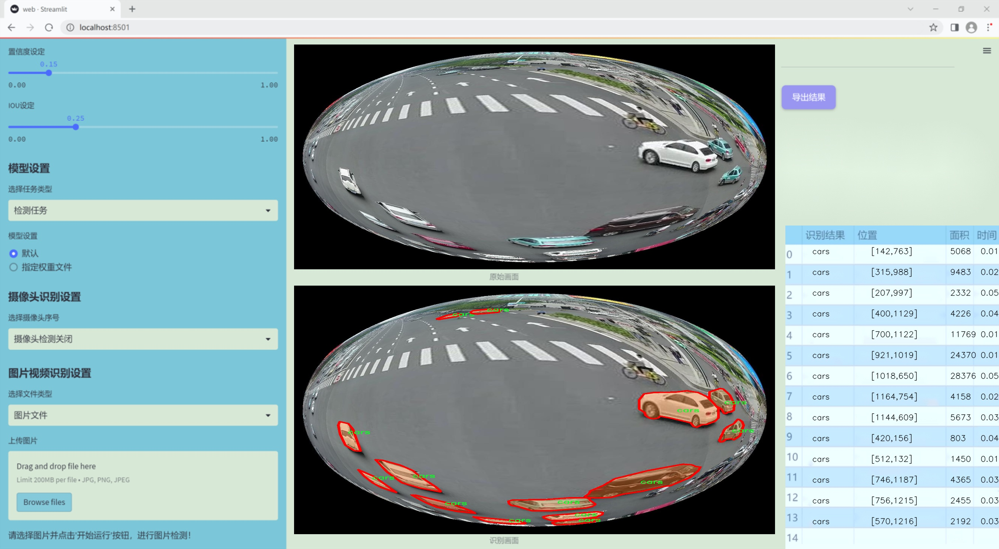
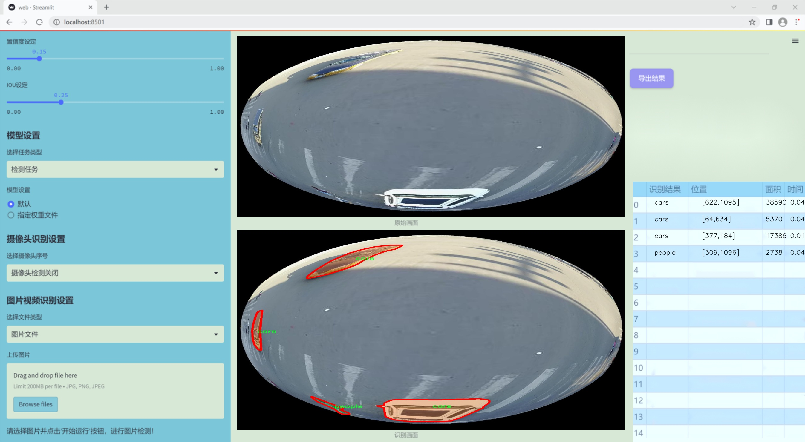
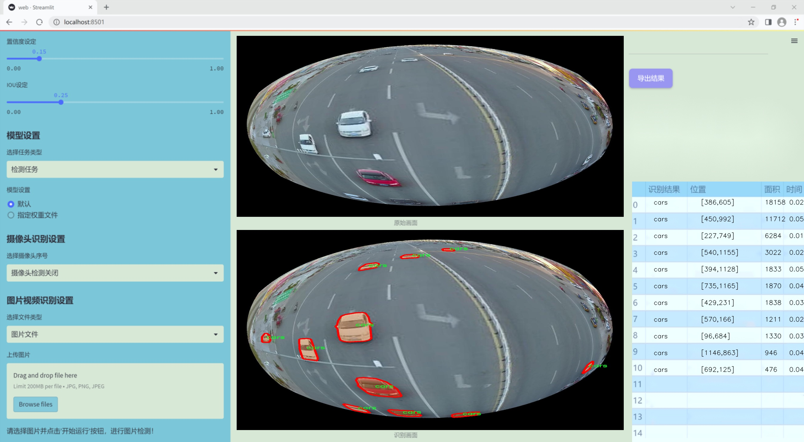
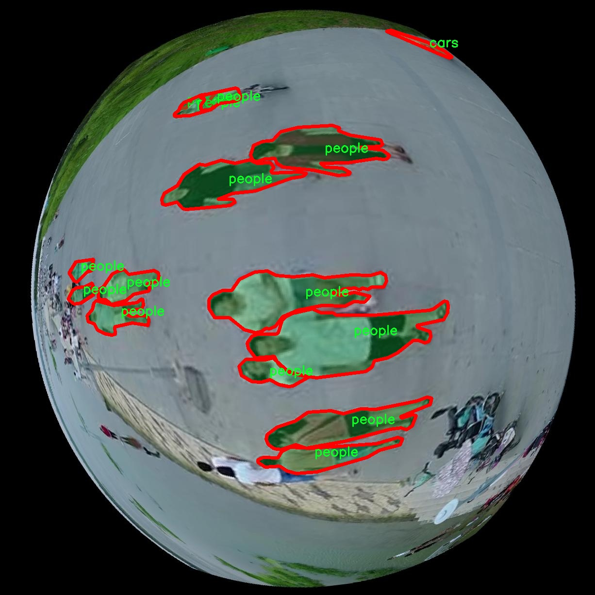
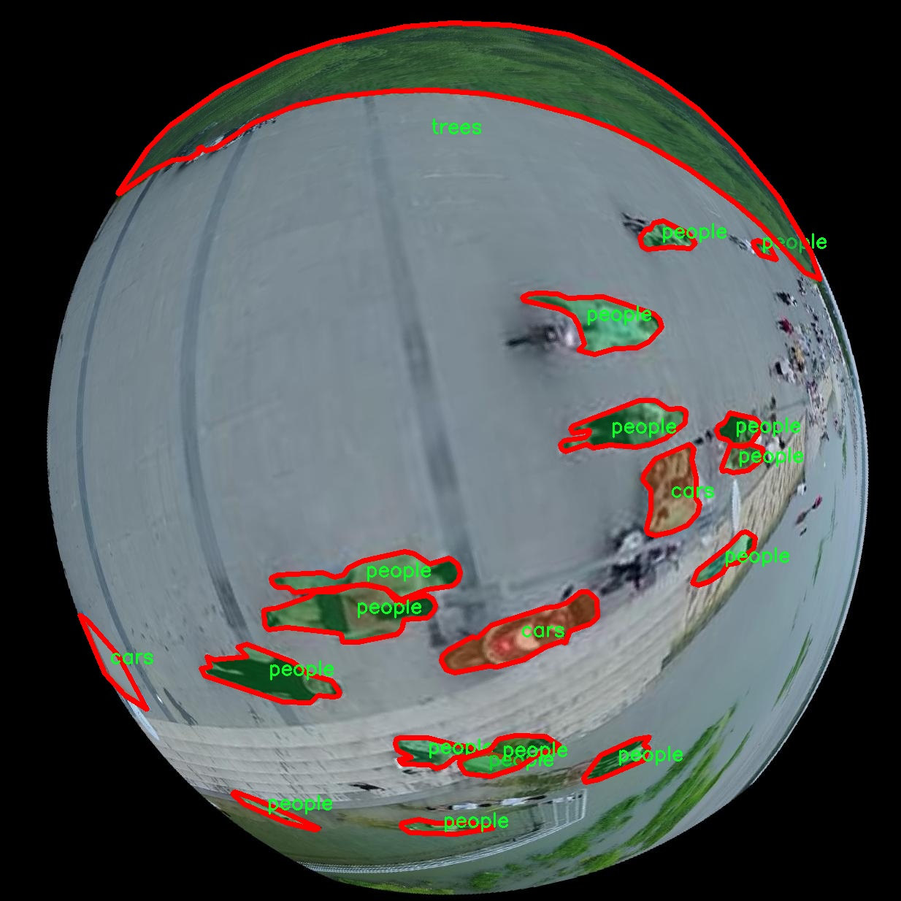
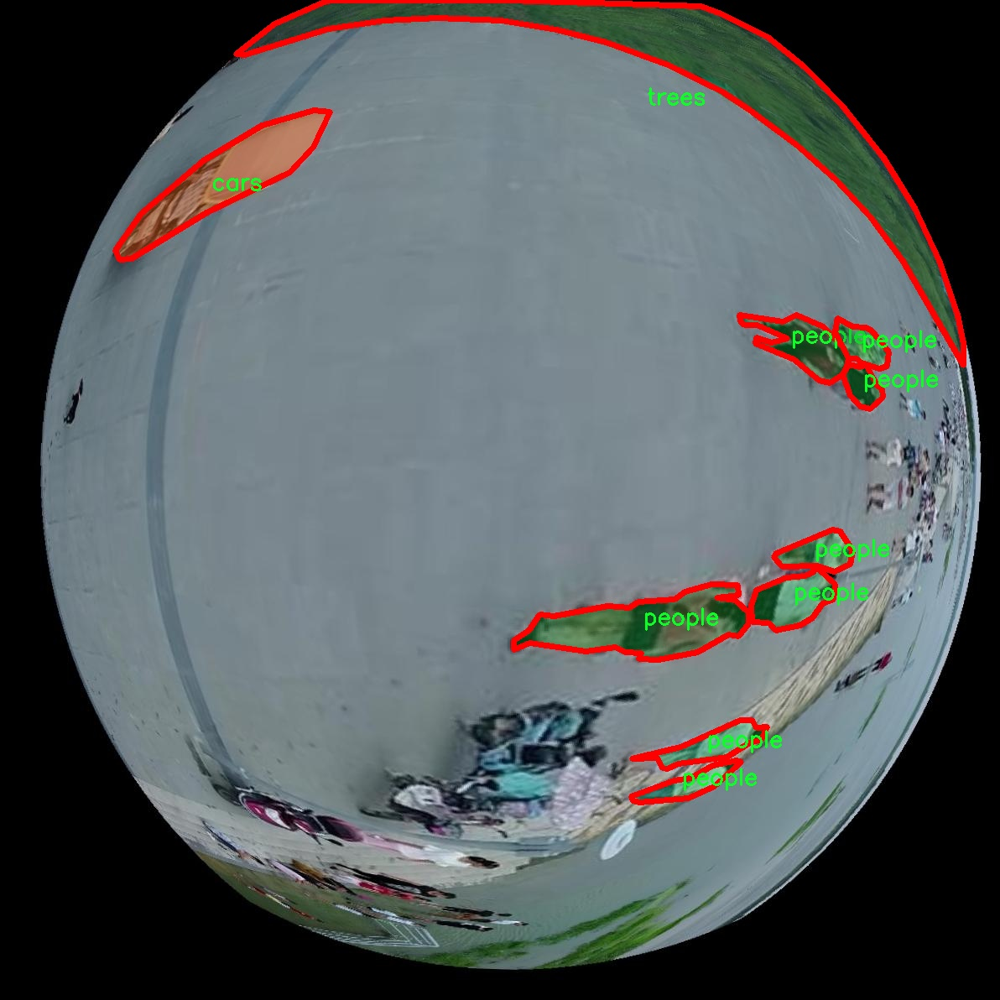
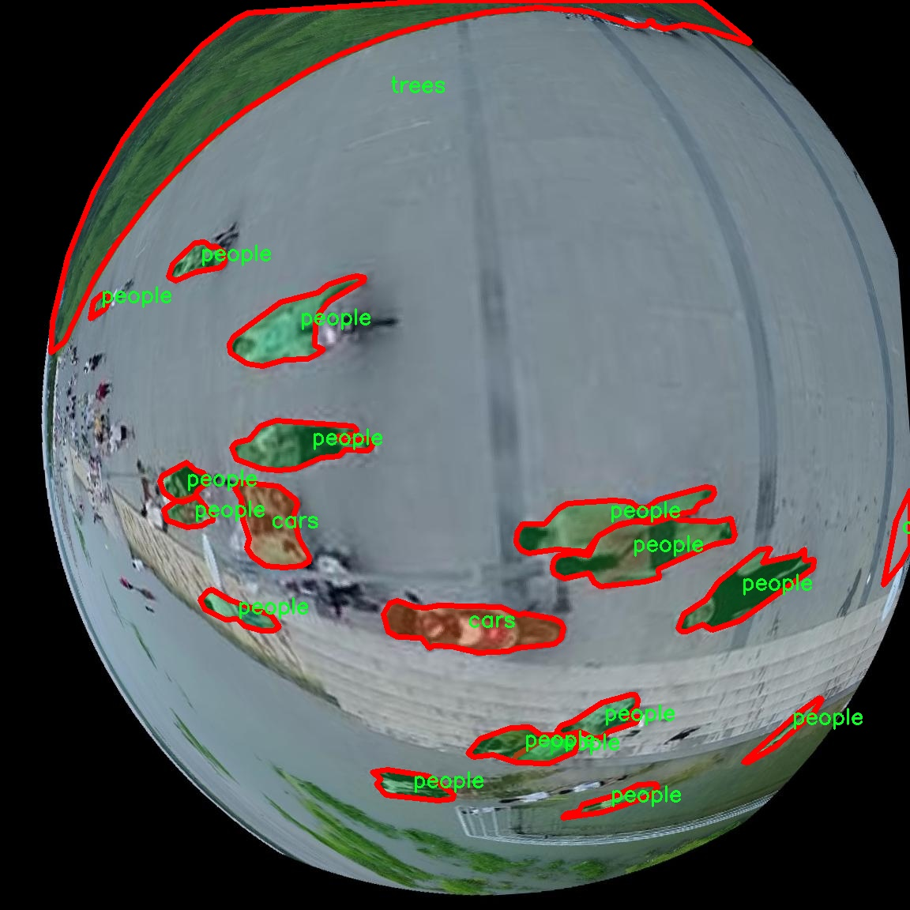
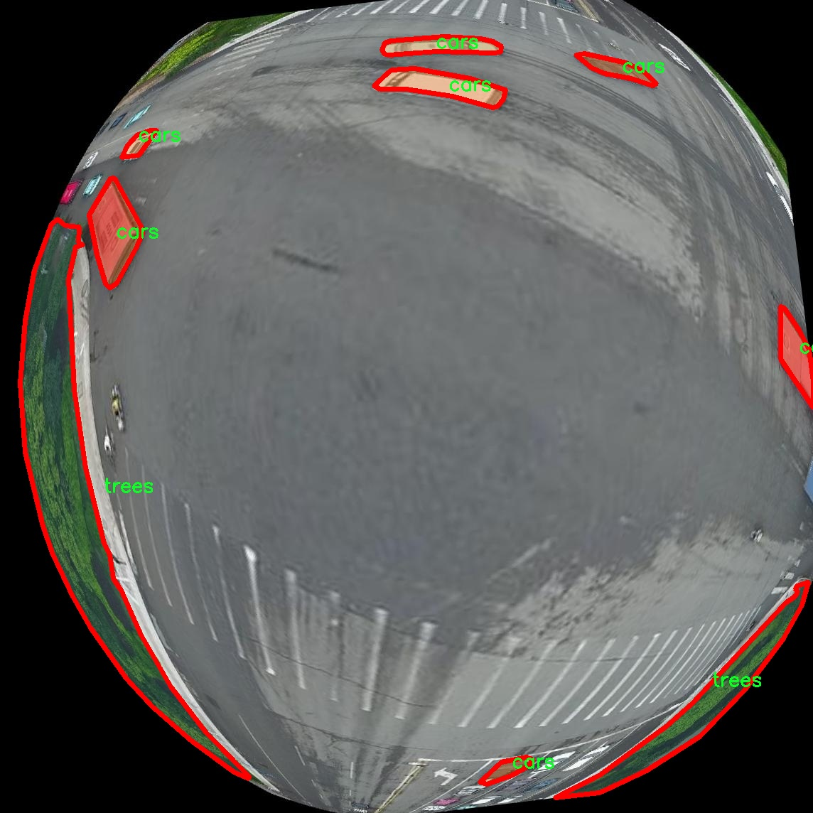

### 1.背景意义

研究背景与意义

随着城市化进程的加快，城市环境中的目标检测需求日益增加。城市环境复杂多变，建筑物、车辆、行人和树木等多种目标在空间中交错分布，给目标检测带来了巨大的挑战。传统的目标检测方法在处理这些复杂场景时，往往面临着识别精度低、检测速度慢等问题。因此，开发一种高效、准确的目标检测系统，尤其是在鱼眼相机捕捉的广角视图中，显得尤为重要。

鱼眼相机因其广阔的视野和高分辨率，能够有效捕捉城市环境中的多种目标，成为城市监控和智能交通系统中的重要工具。然而，鱼眼图像的畸变特性使得目标检测算法的应用面临挑战。为了解决这一问题，基于改进YOLOv11的目标检测系统应运而生。YOLO（You Only Look Once）系列算法以其实时性和高效性在目标检测领域取得了显著的成果。通过对YOLOv11进行改进，可以更好地适应鱼眼图像的特性，提高检测精度和速度。

本研究将使用VIS+UAV数据集，该数据集包含1900张图像，涵盖建筑物、车辆、行人和树木四个类别。这些类别的选择反映了城市环境中最常见的目标类型，为目标检测算法的训练和评估提供了丰富的样本。通过对数据集的深入分析和处理，结合改进的YOLOv11模型，旨在提升城市环境中目标检测的准确性和效率，为智能城市建设提供技术支持。

总之，基于改进YOLOv11的鱼眼相机城市环境目标检测系统的研究，不仅具有重要的理论意义，也在实际应用中具有广泛的前景。随着智能交通、城市安全等领域对目标检测技术的需求不断增长，研究成果将为相关行业的发展提供有力的技术保障。

### 2.视频效果

[2.1 视频效果](https://www.bilibili.com/video/BV1m7CcYaE7s/)

### 3.图片效果







##### [项目涉及的源码数据来源链接](https://kdocs.cn/l/cszuIiCKVNis)**

注意：本项目提供训练的数据集和训练教程,由于版本持续更新,暂不提供权重文件（best.pt）,请按照6.训练教程进行训练后实现上图演示的效果。

### 4.数据集信息

##### 4.1 本项目数据集类别数＆类别名

nc: 4
names: ['building', 'cars', 'people', 'trees']


该项目为【图像分割】数据集，请在【训练教程和Web端加载模型教程（第三步）】这一步的时候按照【图像分割】部分的教程来训练

##### 4.2 本项目数据集信息介绍

本项目数据集信息介绍

本项目旨在改进YOLOv11算法，以实现高效的鱼眼相机城市环境目标检测系统。为此，我们构建了一个专门的数据集，主题为“VIS+UAV”，该数据集涵盖了城市环境中常见的目标物体，主要包括建筑物、汽车、行人和树木四个类别。数据集的类别数量为四（nc: 4），具体类别列表为：建筑物（building）、汽车（cars）、行人（people）和树木（trees）。这些类别的选择旨在反映城市环境的多样性和复杂性，以确保目标检测系统在实际应用中的有效性和可靠性。

数据集的构建过程中，我们采用了多种数据采集方式，包括地面视角（VIS）和无人机（UAV）视角，以获取不同高度和角度下的目标物体图像。这种多样化的采集方式不仅丰富了数据集的内容，还提高了模型在不同场景下的适应能力。每个类别的样本均经过精心标注，确保在训练过程中能够提供准确的监督信息，从而提升模型的检测精度。

此外，为了增强模型的泛化能力，我们在数据集中引入了不同的光照条件、天气变化和城市布局，模拟真实世界中可能遇到的各种情况。这种多样性使得模型在面对复杂环境时，能够更好地识别和定位目标物体。通过对该数据集的训练，我们期望能够显著提升YOLOv11在鱼眼相机城市环境下的目标检测性能，为智能交通、城市监控等应用领域提供强有力的技术支持。











### 5.全套项目环境部署视频教程（零基础手把手教学）

[5.1 所需软件PyCharm和Anaconda安装教程（第一步）](https://www.bilibili.com/video/BV1BoC1YCEKi/?spm_id_from=333.999.0.0&vd_source=bc9aec86d164b67a7004b996143742dc)


[5.2 安装Python虚拟环境创建和依赖库安装视频教程（第二步）](https://www.bilibili.com/video/BV1ZoC1YCEBw?spm_id_from=333.788.videopod.sections&vd_source=bc9aec86d164b67a7004b996143742dc)

### 6.改进YOLOv11训练教程和Web_UI前端加载模型教程（零基础手把手教学）

[6.1 改进YOLOv11训练教程和Web_UI前端加载模型教程（第三步）](https://www.bilibili.com/video/BV1BoC1YCEhR?spm_id_from=333.788.videopod.sections&vd_source=bc9aec86d164b67a7004b996143742dc)


按照上面的训练视频教程链接加载项目提供的数据集，运行train.py即可开始训练



     Epoch   gpu_mem       box       obj       cls    labels  img_size
     1/200     20.8G   0.01576   0.01955  0.007536        22      1280: 100%|██████████| 849/849 [14:42<00:00,  1.04s/it]
               Class     Images     Labels          P          R     mAP@.5 mAP@.5:.95: 100%|██████████| 213/213 [01:14<00:00,  2.87it/s]
                 all       3395      17314      0.994      0.957      0.0957      0.0843

     Epoch   gpu_mem       box       obj       cls    labels  img_size
     2/200     20.8G   0.01578   0.01923  0.007006        22      1280: 100%|██████████| 849/849 [14:44<00:00,  1.04s/it]
               Class     Images     Labels          P          R     mAP@.5 mAP@.5:.95: 100%|██████████| 213/213 [01:12<00:00,  2.95it/s]
                 all       3395      17314      0.996      0.956      0.0957      0.0845

     Epoch   gpu_mem       box       obj       cls    labels  img_size
     3/200     20.8G   0.01561    0.0191  0.006895        27      1280: 100%|██████████| 849/849 [10:56<00:00,  1.29it/s]
               Class     Images     Labels          P          R     mAP@.5 mAP@.5:.95: 100%|███████   | 187/213 [00:52<00:00,  4.04it/s]
                 all       3395      17314      0.996      0.957      0.0957      0.0845


###### [项目数据集下载链接](https://kdocs.cn/l/cszuIiCKVNis)

### 7.原始YOLOv11算法讲解


YOLO11 是 Ultralytics YOLO 系列的最新版本，结合了尖端的准确性、速度和效率，用于目标检测、分割、分类、定向边界框和姿态估计。与
YOLOv8 相比，它具有更少的参数和更好的结果，不难预见，YOLO11 在边缘设备上更高效、更快，将频繁出现在计算机视觉领域的最先进技术（SOTA）中。


**主要特点**

  * **增强的特征提取：**YOLO11 使用改进的主干和颈部架构来增强特征提取，以实现更精确的目标检测和复杂任务的性能。

  * **针对效率和速度优化：**精细的架构设计和优化的训练流程在保持准确性和性能之间最佳平衡的同时，提供更快的处理速度。

  * **更少的参数，更高的准确度：**YOLO11m 在 COCO 数据集上实现了比 YOLOv8m 更高的 mAP，参数减少了 22%，提高了计算效率，同时不牺牲准确度。

  * **跨环境的适应性：**YOLO11 可以无缝部署在边缘设备、云平台和配备 NVIDIA GPU 的系统上，确保最大的灵活性。

  * **支持广泛的任务范围：**YOLO11 支持各种计算机视觉任务，如目标检测、实例分割、图像分类、姿态估计和定向目标检测（OBB）。


### 8.200+种全套改进YOLOV11创新点原理讲解

#### 8.1 200+种全套改进YOLOV11创新点原理讲解大全

由于篇幅限制，每个创新点的具体原理讲解就不全部展开，具体见下列网址中的改进模块对应项目的技术原理博客网址【Blog】（创新点均为模块化搭建，原理适配YOLOv5~YOLOv11等各种版本）

[改进模块技术原理博客【Blog】网址链接](https://gitee.com/qunmasj/good)


#### 8.2 精选部分改进YOLOV11创新点原理讲解

###### 这里节选部分改进创新点展开原理讲解(完整的改进原理见上图和[改进模块技术原理博客链接](https://gitee.com/qunmasj/good)【如果此小节的图加载失败可以通过CSDN或者Github搜索该博客的标题访问原始博客，原始博客图片显示正常】


借鉴了其他算法的这些设计思想

借鉴了VGG的思想，使用了较多的3×3卷积，在每一次池化操作后，将通道数翻倍；

借鉴了network in network的思想，使用全局平均池化（global average pooling）做预测，并把1×1的卷积核置于3×3的卷积核之间，用来压缩特征；（我没找到这一步体现在哪里）

使用了批归一化层稳定模型训练，加速收敛，并且起到正则化作用。

    以上三点为Darknet19借鉴其他模型的点。Darknet53当然是在继承了Darknet19的这些优点的基础上再新增了下面这些优点的。因此列在了这里

借鉴了ResNet的思想，在网络中大量使用了残差连接，因此网络结构可以设计的很深，并且缓解了训练中梯度消失的问题，使得模型更容易收敛。

使用步长为2的卷积层代替池化层实现降采样。（这一点在经典的Darknet-53上是很明显的，output的长和宽从256降到128，再降低到64，一路降低到8，应该是通过步长为2的卷积层实现的；在YOLOv11的卷积层中也有体现，比如图中我标出的这些位置）

#### 特征融合

模型架构图如下

  Darknet-53的特点可以这样概括：（Conv卷积模块+Residual Block残差块）串行叠加4次

  Conv卷积层+Residual Block残差网络就被称为一个stage


上面红色指出的那个，原始的Darknet-53里面有一层 卷积，在YOLOv11里面，把一层卷积移除了

为什么移除呢？

        原始Darknet-53模型中间加的这个卷积层做了什么？滤波器（卷积核）的个数从 上一个卷积层的512个，先增加到1024个卷积核，然后下一层卷积的卷积核的个数又降低到512个

        移除掉这一层以后，少了1024个卷积核，就可以少做1024次卷积运算，同时也少了1024个3×3的卷积核的参数，也就是少了9×1024个参数需要拟合。这样可以大大减少了模型的参数，（相当于做了轻量化吧）

        移除掉这个卷积层，可能是因为作者发现移除掉这个卷积层以后，模型的score有所提升，所以才移除掉的。为什么移除掉以后，分数有所提高呢？可能是因为多了这些参数就容易，参数过多导致模型在训练集删过拟合，但是在测试集上表现很差，最终模型的分数比较低。你移除掉这个卷积层以后，参数减少了，过拟合现象不那么严重了，泛化能力增强了。当然这个是，拿着你做实验的结论，反过来再找补，再去强行解释这种现象的合理性。

过拟合


通过MMdetection官方绘制册这个图我们可以看到，进来的这张图片经过一个“Feature Pyramid Network(简称FPN)”，然后最后的P3、P4、P5传递给下一层的Neck和Head去做识别任务。 PAN（Path Aggregation Network）


“FPN是自顶向下，将高层的强语义特征传递下来。PAN就是在FPN的后面添加一个自底向上的金字塔，对FPN补充，将低层的强定位特征传递上去，

FPN是自顶（小尺寸，卷积次数多得到的结果，语义信息丰富）向下（大尺寸，卷积次数少得到的结果），将高层的强语义特征传递下来，对整个金字塔进行增强，不过只增强了语义信息，对定位信息没有传递。PAN就是针对这一点，在FPN的后面添加一个自底（卷积次数少，大尺寸）向上（卷积次数多，小尺寸，语义信息丰富）的金字塔，对FPN补充，将低层的强定位特征传递上去，又被称之为“双塔战术”。

FPN层自顶向下传达强语义特征，而特征金字塔则自底向上传达强定位特征，两两联手，从不同的主干层对不同的检测层进行参数聚合,这样的操作确实很皮。
#### 自底向上增强

而 PAN（Path Aggregation Network）是对 FPN 的一种改进，它的设计理念是在 FPN 后面添加一个自底向上的金字塔。PAN 引入了路径聚合的方式，通过将浅层特征图（低分辨率但语义信息较弱）和深层特征图（高分辨率但语义信息丰富）进行聚合，并沿着特定的路径传递特征信息，将低层的强定位特征传递上去。这样的操作能够进一步增强多尺度特征的表达能力，使得 PAN 在目标检测任务中表现更加优秀。


### 可重参化EfficientRepBiPAN优化Neck
#### Repvgg-style
Repvgg-style的卷积层包含
卷积+ReLU结构，该结构能够有效地利用硬件资源。

在训练时，Repvgg-style的卷积层包含
卷积、
卷积、identity。（下图左图）


在推理时，通过重参数化（re-parameterization），上述的多分支结构可以转换为单分支的
卷积。（下图右图）


基于上述思想，作者设计了对GPU硬件友好的EfficientRep Backbone和Rep-PAN Neck，将它们用于YOLOv6中。

EfficientRep Backbone的结构图：


Rep-PAN Neck结构图：


#### Multi-path
只使用repvgg-style不能达到很好的精度-速度平衡，对于大模型，作者探索了多路径的网络结构。

参考该博客提出了Bep unit，其结构如下图所示：


CSP（Cross Stage Partial）-style计算量小，且有丰富的梯度融合信息，广泛应用于YOLO系列中，比如YOLOv11、PPYOLOE。

作者将Bep unit与CSP-style结合，设计了一种新的网络结构BepC3，如下图所示：


基于BepC3模块，作者设计了新的CSPBep Backbone和CSPRepPAN Neck，以达到很好的精度-速度平衡。

其他YOLO系列在使用CSP-stype结构时，partial ratio设置为1/2。为了达到更好的性能，在YOLOv6m中partial ratio的值为2/3，在YOLOv6l中partial ratio的值为1/2。

对于YOLOv6m，单纯使用Rep-style结构和使用BepC3结构的对比如下图所示：

#### BIFPN
BiFPN 全称 Bidirectional Feature Pyramid Network 加权双向（自顶向下 + 自低向上）特征金字塔网络。

相比较于PANet，BiFPN在设计上的改变：

总结下图：
图d 蓝色部分为自顶向下的通路，传递的是高层特征的语义信息；红色部分是自底向上的通路，传递的是低层特征的位置信息；紫色部分是上述第二点提到的同一层在输入节点和输入节点间新加的一条边。


我们删除那些只有一条输入边的节点。这么做的思路很简单：如果一个节点只有一条输入边而没有特征融合，那么它对旨在融合不同特征的特征网络的贡献就会很小。删除它对我们的网络影响不大，同时简化了双向网络；如上图d 的 P7右边第一个节点

如果原始输入节点和输出节点处于同一层，我们会在原始输入节点和输出节点之间添加一条额外的边。思路：以在不增加太多成本的情况下融合更多的特性；

与只有一个自顶向下和一个自底向上路径的PANet不同，我们处理每个双向路径(自顶向下和自底而上)路径作为一个特征网络层，并重复同一层多次，以实现更高层次的特征融合。如下图EfficientNet 的网络结构所示，我们对BiFPN是重复使用多次的。而这个使用次数也不是我们认为设定的，而是作为参数一起加入网络的设计当中，使用NAS技术算出来的。


Weighted Feature Fusion 带权特征融合：学习不同输入特征的重要性，对不同输入特征有区分的融合。
设计思路：传统的特征融合往往只是简单的 feature map 叠加/相加 (sum them up)，比如使用concat或者shortcut连接，而不对同时加进来的 feature map 进行区分。然而，不同的输入 feature map 具有不同的分辨率，它们对融合输入 feature map 的贡献也是不同的，因此简单的对他们进行相加或叠加处理并不是最佳的操作。所以这里我们提出了一种简单而高效的加权特融合的机制。
常见的带权特征融合有三种方法，分别是：


​
  这种方法比较简单，直接加一个可学习的权重。但是由于这个权重不受限制，所有可能引起训练的不稳定，所有并不推荐。
Softmax-based fusion: O = ∑ i e w i ∗ I i ϵ + ∑ j e w j O = \sum_{i} \frac{e^{w_i} * I_i}{ \epsilon+\sum_{j}e^{w_j}}O=∑ 

 

​
  使用这种方法可以将范围放缩到 [ 0 , 1 ] [0, 1][0,1] 之间，训练稳定，但是训练很慢，所有也不推荐。
Fast normalized fusion: O = ∑ i w i ∗ I i ϵ + ∑ j w j O = \sum_{i} \frac{w_i * I_i}{ \epsilon+\sum_{j}w_j}O=∑ 


### 9.系统功能展示

图9.1.系统支持检测结果表格显示

  图9.2.系统支持置信度和IOU阈值手动调节

  图9.3.系统支持自定义加载权重文件best.pt(需要你通过步骤5中训练获得)

  图9.4.系统支持摄像头实时识别

  图9.5.系统支持图片识别

  图9.6.系统支持视频识别

  图9.7.系统支持识别结果文件自动保存

  图9.8.系统支持Excel导出检测结果数据


### 10. YOLOv11核心改进源码讲解

#### 10.1 mamba_yolo.py

下面是经过简化和注释的核心代码部分，保留了主要的功能和结构，并添加了详细的中文注释。

```python
import torch
import torch.nn as nn
from einops import rearrange

# 自定义的二维层归一化
class LayerNorm2d(nn.Module):
    def __init__(self, normalized_shape, eps=1e-6, elementwise_affine=True):
        super().__init__()
        self.norm = nn.LayerNorm(normalized_shape, eps, elementwise_affine)

    def forward(self, x):
        # 将输入张量的维度从 (B, C, H, W) 转换为 (B, H, W, C)
        x = rearrange(x, 'b c h w -> b h w c').contiguous()
        x = self.norm(x)  # 应用层归一化
        # 再将维度转换回 (B, C, H, W)
        x = rearrange(x, 'b h w c -> b c h w').contiguous()
        return x

# 自动计算填充
def autopad(k, p=None, d=1):
    """根据卷积核大小自动计算填充以保持输出形状相同"""
    if d > 1:
        k = d * (k - 1) + 1 if isinstance(k, int) else [d * (x - 1) + 1 for x in k]  # 实际卷积核大小
    if p is None:
        p = k // 2 if isinstance(k, int) else [x // 2 for x in k]  # 自动填充
    return p

# 交叉扫描功能
class CrossScan(torch.autograd.Function):
    @staticmethod
    def forward(ctx, x: torch.Tensor):
        B, C, H, W = x.shape
        ctx.shape = (B, C, H, W)
        xs = x.new_empty((B, 4, C, H * W))  # 创建新的张量用于存储不同方向的特征
        xs[:, 0] = x.flatten(2, 3)  # 原始特征
        xs[:, 1] = x.transpose(dim0=2, dim1=3).flatten(2, 3)  # 旋转90度的特征
        xs[:, 2:4] = torch.flip(xs[:, 0:2], dims=[-1])  # 翻转特征
        return xs

    @staticmethod
    def backward(ctx, ys: torch.Tensor):
        B, C, H, W = ctx.shape
        L = H * W
        # 反向传播时的计算
        ys = ys[:, 0:2] + ys[:, 2:4].flip(dims=[-1]).view(B, 2, -1, L)
        y = ys[:, 0] + ys[:, 1].view(B, -1, W, H).transpose(dim0=2, dim1=3).contiguous().view(B, -1, L)
        return y.view(B, -1, H, W)

# 选择性扫描核心功能
class SelectiveScanCore(torch.autograd.Function):
    @staticmethod
    @torch.cuda.amp.custom_fwd
    def forward(ctx, u, delta, A, B, C, D=None, delta_bias=None, delta_softplus=False, nrows=1, backnrows=1):
        # 确保输入张量是连续的
        if u.stride(-1) != 1:
            u = u.contiguous()
        if delta.stride(-1) != 1:
            delta = delta.contiguous()
        if D is not None and D.stride(-1) != 1:
            D = D.contiguous()
        if B.stride(-1) != 1:
            B = B.contiguous()
        if C.stride(-1) != 1:
            C = C.contiguous()
        
        # 处理输入并调用CUDA核心实现
        out, x, *rest = selective_scan_cuda_core.fwd(u, delta, A, B, C, D, delta_bias, delta_softplus, 1)
        ctx.save_for_backward(u, delta, A, B, C, D, delta_bias, x)  # 保存用于反向传播的张量
        return out

    @staticmethod
    @torch.cuda.amp.custom_bwd
    def backward(ctx, dout, *args):
        u, delta, A, B, C, D, delta_bias, x = ctx.saved_tensors
        du, ddelta, dA, dB, dC, dD, ddelta_bias, *rest = selective_scan_cuda_core.bwd(
            u, delta, A, B, C, D, delta_bias, dout, x, ctx.delta_softplus, 1
        )
        return (du, ddelta, dA, dB, dC, dD, ddelta_bias, None, None, None, None)

# 选择性扫描的主函数
def cross_selective_scan(x: torch.Tensor, x_proj_weight: torch.Tensor, dt_projs_weight: torch.Tensor, A_logs: torch.Tensor, Ds: torch.Tensor, out_norm: nn.Module = None):
    B, D, H, W = x.shape
    L = H * W

    xs = CrossScan.apply(x)  # 应用交叉扫描
    x_dbl = torch.einsum("b k d l, k c d -> b k c l", xs, x_proj_weight)  # 特征投影
    dts, Bs, Cs = torch.split(x_dbl, [R, N, N], dim=2)  # 分割投影结果

    # HiPPO矩阵
    As = -torch.exp(A_logs.to(torch.float))  # 转换为负的指数形式
    Ds = Ds.to(torch.float)  # 转换为浮点数

    # 调用选择性扫描核心
    ys: torch.Tensor = SelectiveScan.apply(xs, dts, As, Bs, Cs, Ds, delta_bias=None, delta_softplus=True).view(B, K, -1, H, W)
    y: torch.Tensor = CrossMerge.apply(ys)  # 应用交叉合并

    # 输出归一化
    if out_norm is not None:
        y = out_norm(y)

    return y

# 主要的神经网络模块
class SS2D(nn.Module):
    def __init__(self, d_model=96, d_state=16, ssm_ratio=2.0, act_layer=nn.SiLU, dropout=0.0):
        super().__init__()
        self.in_proj = nn.Conv2d(d_model, d_model * ssm_ratio, kernel_size=1)  # 输入投影
        self.out_proj = nn.Conv2d(d_model * ssm_ratio, d_model, kernel_size=1)  # 输出投影
        self.dropout = nn.Dropout(dropout)  # Dropout层
        self.act = act_layer()  # 激活函数

    def forward(self, x: torch.Tensor):
        x = self.in_proj(x)  # 输入投影
        x = self.act(x)  # 激活
        x = self.dropout(x)  # Dropout
        x = self.out_proj(x)  # 输出投影
        return x

# 简单的Stem模块
class SimpleStem(nn.Module):
    def __init__(self, inp, embed_dim, ks=3):
        super().__init__()
        self.conv = nn.Sequential(
            nn.Conv2d(inp, embed_dim // 2, kernel_size=ks, stride=2, padding=autopad(ks), bias=False),
            nn.BatchNorm2d(embed_dim // 2),
            nn.GELU(),
            nn.Conv2d(embed_dim // 2, embed_dim, kernel_size=ks, stride=2, padding=autopad(ks), bias=False),
            nn.BatchNorm2d(embed_dim),
            nn.SiLU(),
        )

    def forward(self, x):
        return self.conv(x)  # 直接返回卷积结果
```

以上代码包含了神经网络中的核心模块，包括自定义的层归一化、交叉扫描、选择性扫描等功能模块。每个模块都添加了详细的中文注释，以便理解其功能和实现逻辑。

这个程序文件 `mamba_yolo.py` 是一个基于 PyTorch 的深度学习模型实现，主要用于计算机视觉任务，特别是与 YOLO（You Only Look Once）相关的模型。代码中包含了多个自定义的神经网络模块和函数，以下是对其主要内容的逐步分析。

首先，文件导入了一些必要的库，包括 PyTorch、数学库、以及一些用于深度学习的模块，如 `torch.nn` 和 `einops`。`DropPath` 是一种用于正则化的技术，能够在训练过程中随机丢弃某些路径，以提高模型的泛化能力。

接下来，定义了一个 `LayerNorm2d` 类，继承自 `nn.Module`，用于实现二维层归一化。该类在前向传播中将输入张量的形状进行调整，以适应 `LayerNorm` 的要求。

`autopad` 函数用于自动计算卷积操作的填充，以确保输出形状与输入形状相同。它根据卷积核的大小和填充参数来决定填充的大小。

接下来，定义了几个自定义的 `torch.autograd.Function` 类，包括 `CrossScan` 和 `CrossMerge`，这些类实现了前向和反向传播的功能，主要用于处理张量的交叉扫描和合并操作。

`SelectiveScanCore` 类实现了选择性扫描的核心功能，利用 CUDA 加速进行高效的前向和反向传播。选择性扫描是一种在序列数据中进行高效计算的技术，能够减少计算复杂度。

`cross_selective_scan` 函数则是一个封装函数，整合了选择性扫描的各个步骤，处理输入张量并进行相应的变换和归一化。

接下来，定义了 `SS2D` 类，这是一个基于选择性扫描的模块，包含了多个参数和层的初始化，支持不同的前向传播类型。它的设计考虑了低秩近似和多种激活函数的使用。

`RGBlock` 和 `LSBlock` 是两个基本的网络块，分别实现了不同的卷积和激活操作，能够用于构建更复杂的网络结构。

`XSSBlock` 和 `VSSBlock_YOLO` 是更高级的模块，结合了选择性扫描和其他特性，能够在输入特征上进行复杂的变换和处理。这些模块通常用于构建 YOLO 等目标检测模型的骨干网络。

`SimpleStem` 是一个简单的网络结构，用于将输入特征映射到更高维度的特征空间，通常作为网络的输入层。

最后，`VisionClueMerge` 类实现了特征融合的功能，通过对输入特征进行下采样和卷积操作，生成合并后的特征图。

整体来看，这个文件实现了一个复杂的深度学习模型，结合了选择性扫描、层归一化、卷积操作等多种技术，适用于计算机视觉任务，尤其是目标检测领域。

#### 10.2 transformer.py

以下是经过简化和注释的核心代码部分：

```python
import torch
import torch.nn as nn
from functools import partial

# 导入自定义的归一化模块
from .prepbn import RepBN, LinearNorm
from ..modules.transformer import TransformerEncoderLayer

# 定义线性归一化的部分应用函数
ln = nn.LayerNorm
linearnorm = partial(LinearNorm, norm1=ln, norm2=RepBN, step=60000)

class TransformerEncoderLayer_RepBN(TransformerEncoderLayer):
    def __init__(self, c1, cm=2048, num_heads=8, dropout=0, act=..., normalize_before=False):
        # 初始化父类
        super().__init__(c1, cm, num_heads, dropout, act, normalize_before)
        
        # 使用自定义的归一化层
        self.norm1 = linearnorm(c1)
        self.norm2 = linearnorm(c1)

class AIFI_RepBN(TransformerEncoderLayer_RepBN):
    """定义AIFI变换器层。"""

    def __init__(self, c1, cm=2048, num_heads=8, dropout=0, act=nn.GELU(), normalize_before=False):
        """使用指定参数初始化AIFI实例。"""
        super().__init__(c1, cm, num_heads, dropout, act, normalize_before)

    def forward(self, x):
        """AIFI变换器层的前向传播。"""
        c, h, w = x.shape[1:]  # 获取输入的通道数、高度和宽度
        pos_embed = self.build_2d_sincos_position_embedding(w, h, c)  # 构建位置嵌入
        # 将输入张量从形状[B, C, H, W]展平为[B, HxW, C]
        x = super().forward(x.flatten(2).permute(0, 2, 1), pos=pos_embed.to(device=x.device, dtype=x.dtype))
        # 将输出张量的形状从[B, HxW, C]转换回[B, C, H, W]
        return x.permute(0, 2, 1).view([-1, c, h, w]).contiguous()

    @staticmethod
    def build_2d_sincos_position_embedding(w, h, embed_dim=256, temperature=10000.0):
        """构建2D正弦-余弦位置嵌入。"""
        assert embed_dim % 4 == 0, "嵌入维度必须是4的倍数，以便进行2D正弦-余弦位置嵌入"
        # 创建宽度和高度的网格
        grid_w = torch.arange(w, dtype=torch.float32)
        grid_h = torch.arange(h, dtype=torch.float32)
        grid_w, grid_h = torch.meshgrid(grid_w, grid_h, indexing="ij")
        
        pos_dim = embed_dim // 4  # 计算位置维度
        omega = torch.arange(pos_dim, dtype=torch.float32) / pos_dim
        omega = 1.0 / (temperature**omega)  # 计算频率

        # 计算正弦和余弦的输出
        out_w = grid_w.flatten()[..., None] @ omega[None]
        out_h = grid_h.flatten()[..., None] @ omega[None]

        # 返回拼接后的正弦和余弦位置嵌入
        return torch.cat([torch.sin(out_w), torch.cos(out_w), torch.sin(out_h), torch.cos(out_h)], 1)[None]
```

### 代码注释说明：
1. **导入模块**：导入必要的PyTorch模块和自定义的归一化模块。
2. **归一化层定义**：使用`partial`函数定义线性归一化和自定义的RepBN归一化。
3. **TransformerEncoderLayer_RepBN类**：继承自`TransformerEncoderLayer`，初始化时定义了两个归一化层。
4. **AIFI_RepBN类**：继承自`TransformerEncoderLayer_RepBN`，定义了AIFI变换器层的结构。
5. **前向传播**：在`forward`方法中，处理输入数据，构建位置嵌入，并将输入数据展平后传递给父类的前向方法，最后将输出恢复为原始形状。
6. **位置嵌入构建**：`build_2d_sincos_position_embedding`方法用于生成2D正弦-余弦位置嵌入，确保嵌入维度是4的倍数，并使用网格计算位置嵌入。

这个程序文件 `transformer.py` 定义了一个基于 Transformer 的编码层，主要实现了 AIFI（Attention Is All You Need with Feature Interaction）结构，并结合了重参数化批归一化（RepBN）和线性归一化（LinearNorm）技术。文件中使用了 PyTorch 库来构建神经网络模型。

首先，文件导入了必要的 PyTorch 模块，包括 `torch` 和 `torch.nn`，以及一些功能性模块。接着，从其他模块中引入了 `RepBN` 和 `LinearNorm`，以及 Transformer 的编码层 `TransformerEncoderLayer` 和 AIFI 相关的功能。

在代码中，定义了一个名为 `linearnorm` 的部分函数，它结合了线性归一化和重参数化批归一化，并设置了一个步长参数。这为后续的归一化层提供了灵活的配置。

接下来，定义了 `TransformerEncoderLayer_RepBN` 类，它继承自 `TransformerEncoderLayer`。在初始化方法中，调用父类的构造函数，并为两个归一化层 `norm1` 和 `norm2` 分别实例化了 `linearnorm`，这使得该层在处理输入时可以应用这两种归一化技术。

然后，定义了 `AIFI_RepBN` 类，继承自 `TransformerEncoderLayer_RepBN`，并在其构造函数中调用父类的构造函数。这个类专门用于实现 AIFI Transformer 层，具有特定的激活函数（默认为 GELU）和其他参数。

在 `AIFI_RepBN` 类中，重写了 `forward` 方法，处理输入数据的前向传播。输入 `x` 的形状为 `[B, C, H, W]`，其中 `B` 是批量大小，`C` 是通道数，`H` 和 `W` 是高和宽。方法中首先调用 `build_2d_sincos_position_embedding` 方法生成二维的正弦余弦位置嵌入，然后将输入数据展平并进行转置，以适应 Transformer 的输入格式。最后，经过父类的前向传播处理后，再将输出数据的形状调整回原来的格式。

`build_2d_sincos_position_embedding` 方法用于构建二维的正弦余弦位置嵌入。该方法首先检查嵌入维度是否能被 4 整除，以确保可以正确生成位置嵌入。接着，创建网格坐标，并计算相应的正弦和余弦值，最终返回一个包含这些嵌入的张量。

总体而言，这个文件实现了一个增强的 Transformer 编码层，结合了现代的归一化技术和位置编码方法，适用于处理图像等二维数据。

#### 10.3 EfficientFormerV2.py

以下是经过简化并添加详细中文注释的核心代码部分：

```python
import torch
import torch.nn as nn
import math
import itertools

class Attention4D(nn.Module):
    def __init__(self, dim=384, key_dim=32, num_heads=8, attn_ratio=4, resolution=7, act_layer=nn.ReLU, stride=None):
        super().__init__()
        self.num_heads = num_heads  # 注意力头的数量
        self.scale = key_dim ** -0.5  # 缩放因子
        self.key_dim = key_dim  # 键的维度
        self.d = int(attn_ratio * key_dim)  # 输出维度
        self.dh = self.d * num_heads  # 头的总维度

        # 如果有步幅，则调整分辨率并定义卷积层
        if stride is not None:
            self.resolution = math.ceil(resolution / stride)
            self.stride_conv = nn.Sequential(
                nn.Conv2d(dim, dim, kernel_size=3, stride=stride, padding=1, groups=dim),
                nn.BatchNorm2d(dim),
            )
            self.upsample = nn.Upsample(scale_factor=stride, mode='bilinear')
        else:
            self.resolution = resolution
            self.stride_conv = None
            self.upsample = None

        self.N = self.resolution ** 2  # 分辨率的平方
        self.q = nn.Conv2d(dim, self.num_heads * self.key_dim, 1)  # 查询卷积层
        self.k = nn.Conv2d(dim, self.num_heads * self.key_dim, 1)  # 键卷积层
        self.v = nn.Conv2d(dim, self.num_heads * self.d, 1)  # 值卷积层

        # 定义注意力偏置
        points = list(itertools.product(range(self.resolution), range(self.resolution)))
        N = len(points)
        attention_offsets = {}
        idxs = []
        for p1 in points:
            for p2 in points:
                offset = (abs(p1[0] - p2[0]), abs(p1[1] - p2[1]))
                if offset not in attention_offsets:
                    attention_offsets[offset] = len(attention_offsets)
                idxs.append(attention_offsets[offset])
        self.attention_biases = nn.Parameter(torch.zeros(num_heads, len(attention_offsets)))
        self.register_buffer('attention_bias_idxs', torch.LongTensor(idxs).view(N, N))

    def forward(self, x):
        B, C, H, W = x.shape  # B: 批量大小, C: 通道数, H: 高度, W: 宽度
        if self.stride_conv is not None:
            x = self.stride_conv(x)  # 应用步幅卷积

        # 计算查询、键和值
        q = self.q(x).flatten(2).reshape(B, self.num_heads, -1, self.N).permute(0, 1, 3, 2)
        k = self.k(x).flatten(2).reshape(B, self.num_heads, -1, self.N).permute(0, 1, 2, 3)
        v = self.v(x)

        # 计算注意力权重
        attn = (q @ k) * self.scale + self.attention_biases[:, self.attention_bias_idxs]
        attn = attn.softmax(dim=-1)  # 归一化

        # 计算输出
        x = (attn @ v).transpose(2, 3).reshape(B, self.dh, self.resolution, self.resolution)
        if self.upsample is not None:
            x = self.upsample(x)  # 上采样

        return x

class EfficientFormerV2(nn.Module):
    def __init__(self, layers, embed_dims, num_classes=1000):
        super().__init__()
        self.patch_embed = nn.Conv2d(3, embed_dims[0], kernel_size=3, stride=2, padding=1)  # 输入层
        self.network = nn.ModuleList()  # 存储网络层

        # 构建网络
        for i in range(len(layers)):
            stage = nn.Sequential(*[Attention4D(embed_dims[i]) for _ in range(layers[i])])  # 添加注意力层
            self.network.append(stage)

    def forward(self, x):
        x = self.patch_embed(x)  # 输入数据经过嵌入层
        for block in self.network:
            x = block(x)  # 通过网络的每一层
        return x

# 创建模型实例
def efficientformerv2_s0():
    model = EfficientFormerV2(layers=[2, 2, 6, 4], embed_dims=[32, 48, 96, 176])
    return model

if __name__ == '__main__':
    inputs = torch.randn((1, 3, 640, 640))  # 创建输入数据
    model = efficientformerv2_s0()  # 创建模型
    res = model(inputs)  # 前向传播
    print(res.size())  # 输出结果的尺寸
```

### 代码说明：
1. **Attention4D类**：实现了一个四维注意力机制，包括查询、键、值的计算，以及注意力权重的生成和应用。
2. **EfficientFormerV2类**：构建了一个高效的变换器模型，包含多个注意力层。
3. **efficientformerv2_s0函数**：用于创建一个特定配置的EfficientFormerV2模型实例。
4. **主程序**：创建一个输入张量，实例化模型并进行前向传播，最后输出结果的尺寸。

这个程序文件实现了一个名为 `EfficientFormerV2` 的深度学习模型，主要用于图像处理任务，如图像分类。该模型的设计灵感来源于 Transformer 架构，结合了卷积神经网络（CNN）的优点，旨在提高计算效率和性能。

首先，文件中定义了一些超参数和模型结构的配置，包括不同规模的模型（如 S0、S1、S2 和 L）的宽度和深度。这些参数以字典的形式存储，便于后续调用和修改。宽度和深度的设置影响模型的复杂度和计算量。

接下来，定义了多个类，构成模型的不同部分。`Attention4D` 类实现了一个四维注意力机制，支持多头注意力和局部注意力。该类通过卷积层提取查询（Q）、键（K）和值（V），并计算注意力权重。注意力机制使得模型能够关注输入数据的不同部分，从而提高特征提取的能力。

`Embedding` 类负责将输入图像转换为嵌入特征，使用卷积层和可选的注意力机制。该类根据不同的参数配置，选择不同的嵌入方式，以适应不同的模型需求。

`Mlp` 和 `FFN` 类实现了多层感知机（MLP）和前馈网络（Feed Forward Network），它们在特征提取后对数据进行进一步处理。`AttnFFN` 类结合了注意力机制和前馈网络，增强了模型的表达能力。

`eformer_block` 函数用于构建模型的基本模块，包含多个注意力和前馈层。`EfficientFormerV2` 类则是整个模型的主体，负责将不同的模块组合在一起，形成完整的网络结构。

在模型的初始化过程中，可以根据需要加载预训练权重，以便在特定任务上进行微调。模型的前向传播方法 `forward` 定义了输入数据如何通过各个模块进行处理，并返回最终的特征输出。

最后，文件中还定义了一些函数（如 `efficientformerv2_s0`、`efficientformerv2_s1` 等），用于实例化不同规模的 EfficientFormerV2 模型，并加载相应的预训练权重。在 `__main__` 部分，提供了一个示例，展示如何创建模型实例并对输入数据进行推理，输出每个阶段的特征图尺寸。

整体而言，这个程序文件展示了如何构建一个高效的图像处理模型，结合了现代深度学习中的多个先进技术，如注意力机制和卷积网络，旨在提高性能和计算效率。

#### 10.4 kacn_conv.py

以下是保留的核心代码部分，并添加了详细的中文注释：

```python
import torch
import torch.nn as nn

class KACNConvNDLayer(nn.Module):
    def __init__(self, conv_class, norm_class, input_dim, output_dim, degree, kernel_size,
                 groups=1, padding=0, stride=1, dilation=1,
                 ndim: int = 2, dropout=0.0):
        super(KACNConvNDLayer, self).__init__()
        
        # 初始化参数
        self.inputdim = input_dim  # 输入维度
        self.outdim = output_dim    # 输出维度
        self.degree = degree         # 多项式的度数
        self.kernel_size = kernel_size  # 卷积核大小
        self.padding = padding       # 填充
        self.stride = stride         # 步幅
        self.dilation = dilation     # 膨胀
        self.groups = groups         # 分组卷积的组数
        self.ndim = ndim             # 数据的维度（1D, 2D, 3D）
        self.dropout = None          # dropout层初始化为None

        # 如果dropout大于0，则根据维度选择相应的dropout层
        if dropout > 0:
            if ndim == 1:
                self.dropout = nn.Dropout1d(p=dropout)
            elif ndim == 2:
                self.dropout = nn.Dropout2d(p=dropout)
            elif ndim == 3:
                self.dropout = nn.Dropout3d(p=dropout)

        # 检查groups参数的有效性
        if groups <= 0:
            raise ValueError('groups must be a positive integer')
        if input_dim % groups != 0:
            raise ValueError('input_dim must be divisible by groups')
        if output_dim % groups != 0:
            raise ValueError('output_dim must be divisible by groups')

        # 初始化层归一化
        self.layer_norm = nn.ModuleList([norm_class(output_dim // groups) for _ in range(groups)])

        # 初始化多项式卷积层
        self.poly_conv = nn.ModuleList([conv_class((degree + 1) * input_dim // groups,
                                                   output_dim // groups,
                                                   kernel_size,
                                                   stride,
                                                   padding,
                                                   dilation,
                                                   groups=1,
                                                   bias=False) for _ in range(groups)])
        
        # 创建一个缓冲区用于存储多项式的系数
        arange_buffer_size = (1, 1, -1,) + tuple(1 for _ in range(ndim))
        self.register_buffer("arange", torch.arange(0, degree + 1, 1).view(*arange_buffer_size))
        
        # 使用Kaiming均匀分布初始化卷积层的权重
        for conv_layer in self.poly_conv:
            nn.init.normal_(conv_layer.weight, mean=0.0, std=1 / (input_dim * (degree + 1) * kernel_size ** ndim))

    def forward_kacn(self, x, group_index):
        # 前向传播过程
        x = torch.tanh(x)  # 应用tanh激活函数
        x = x.acos().unsqueeze(2)  # 计算反余弦并增加一个维度
        x = (x * self.arange).flatten(1, 2)  # 乘以多项式系数并展平
        x = x.cos()  # 计算余弦
        x = self.poly_conv[group_index](x)  # 应用对应组的卷积层
        x = self.layer_norm[group_index](x)  # 应用对应组的层归一化
        if self.dropout is not None:
            x = self.dropout(x)  # 如果有dropout，则应用dropout
        return x

    def forward(self, x):
        # 主前向传播函数
        split_x = torch.split(x, self.inputdim // self.groups, dim=1)  # 按组分割输入
        output = []
        for group_ind, _x in enumerate(split_x):
            y = self.forward_kacn(_x.clone(), group_ind)  # 对每个组调用forward_kacn
            output.append(y.clone())  # 保存输出
        y = torch.cat(output, dim=1)  # 将所有组的输出拼接
        return y
```

### 代码解释：
1. **KACNConvNDLayer**: 这是一个自定义的卷积层类，支持多维卷积（1D, 2D, 3D），并实现了多项式卷积的逻辑。
2. **初始化参数**: 构造函数中初始化了输入输出维度、卷积参数、分组等，并检查了参数的有效性。
3. **前向传播**: `forward_kacn`方法实现了具体的前向传播逻辑，包括激活函数、卷积操作和归一化处理。`forward`方法则负责将输入按组分割并调用`forward_kacn`进行处理。
4. **权重初始化**: 使用Kaiming初始化方法来提高模型训练的起始效果。

这个程序文件定义了一个名为 `kacn_conv.py` 的 PyTorch 模块，主要实现了一个新的卷积层 `KACNConvNDLayer` 及其一维、二维和三维的具体实现。这个卷积层结合了多项式卷积和归一化层，旨在增强神经网络的表达能力。

首先，`KACNConvNDLayer` 类是一个通用的卷积层，支持不同维度的卷积操作。它的构造函数接受多个参数，包括卷积类、归一化类、输入和输出维度、卷积核大小、分组数、填充、步幅、扩张、维度数量以及丢弃率。构造函数中首先进行了一些参数的验证，比如分组数必须为正整数，输入和输出维度必须能被分组数整除。接着，初始化了归一化层和多项式卷积层，并使用 Kaiming 正态分布初始化卷积层的权重，以帮助模型更好地训练。

在 `forward_kacn` 方法中，输入数据首先经过双曲正切激活函数处理，然后进行反余弦变换，并根据预先定义的 `arange` 张量进行变换，最后通过对应的多项式卷积层和归一化层进行处理。如果设置了丢弃率，还会应用丢弃层。该方法返回处理后的输出。

`forward` 方法负责将输入数据按组进行分割，并依次调用 `forward_kacn` 方法处理每个组的输入，最后将所有组的输出拼接在一起返回。

接下来，`KACNConv3DLayer`、`KACNConv2DLayer` 和 `KACNConv1DLayer` 类分别继承自 `KACNConvNDLayer`，并为三维、二维和一维卷积提供了具体的实现。这些类在构造函数中调用父类的构造函数，传入相应的卷积和归一化类（如 `nn.Conv3d`、`nn.Conv2d` 和 `nn.Conv1d`）以及其他参数。

总的来说，这个文件实现了一个灵活且功能强大的卷积层，适用于多种维度的卷积操作，能够有效地增强深度学习模型的性能。

### 11.完整训练+Web前端界面+200+种全套创新点源码、数据集获取


# [下载链接：https://mbd.pub/o/bread/Z52TlJ1u](https://mbd.pub/o/bread/Z52TlJ1u)